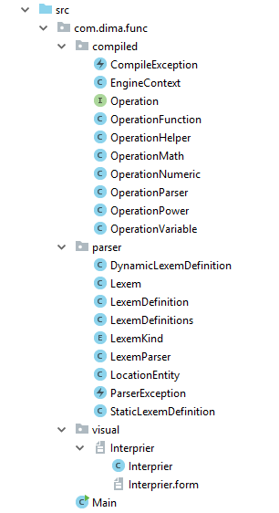
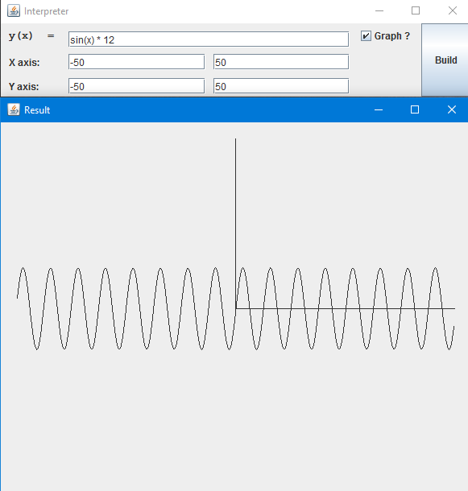

# RZP_quest
Финальное задание для РЗП

# Постановка задачи
> Написать программу "интерпретатор выражения", позволяющую вычислить введенное выражение. Распознание и вычисление выражения организованно без использования готовых библиотек.

# Принцип работы
Возьмём, например, выражение **2 + 3 * 4 - 10 + 5**  
Оно будет обработано программой следующим образом:  
1.	Запускается парсер выражения  
2.	Запускается функция деления на части со значением level = 0(по плюсам)  
В результате в этой функции выражение разделится на  
2  
3 * 4 - 10  
5  
3.	На каждой части запускается деления на части со значением level = 1 (минус) и так далее  
1 часть делится на:  
2  
2 часть делится на:  
3 * 4  
10  
3 часть делится на:  
5  
4.	На 4 уровне каждый примитив(то, что останется после деления выражения по всем арифметическим знакам +-*/) обрабатывается в отдельной функции. Скобки в программе представляются одной лексемой(BRACE), которая содержит в себе лексемы childs. Если примитив состоит из одних скобок, то скобки поступают далее на делитель арифметики - предыщую функцию(п.3), а полученный результат вставляется в эти скобки, и скобки так же возвращаются. Что-то вроде матрёшки.  
Если примитив состоит из числа, то возвращаем объект типа ***NumericOperation***(Класс, возвращающий число).  
Если примитив начинается с Идентификатора, то проверяется следующая лексема.  
Если за примитивом стоят скобки, то это будет функция и парсится как функция. Аргументы функции парсятся как и арифметика, но делителем выступает запятая. Примитивы между запятыми парсятся как примитивы.
5.	После парсинга вызывается исполнение. Класс ***OperationMath*** со значением "+" по очереди запускает каждый свой подобъект и складывает их между собой.(Подобъект - это ***OperationMath*** со значением "-"). Этот процесс идёт до тех пор, пока не дойдет до последнего уровня.  
Числовые константы в  ***OperationMath*** исполняются и возвращают числа, записанные в них, а сам класс берёт это число и делает арифметические операции с ним.  
К примеру, на вход была строка **"sin(10)"**. Внутри числовая константа, сверху объект функции, которая исполняет объекты внутри аргументов. Числовая константа возвращает 10, затем функция берёт **sin** от этой константы и возвращает результат наверх.  
## Реализованные операции:
- сложение(+), вычитание(-), умножение(*), деление(/), возведение в степень(^)
- sin(), cos()

# Документация
Программа состоит из 3 модулей:  
  

## compiled
- **CompileException.java** - обработка ошибок компиляции пропаршенных лексем
- **EngineContext.java** - 
- **Operation.java**
- **OperationFunction.java**
- **OperationHelper.java**
- **OperationMath.java**
- **OperationNumeric.java**
- **OperationParser.java**
- **OperationPower.java**
- **OperationVariable.java**
____
## parser
- **DynamicLexemParser.java**
- **Lexem.java**
- **LexemDefinition.java**
- **LexemDefinitions.java**
- **LexemKind.java**
- **LexemParser.java**
- **LocationEntity.java**
- **ParserException.java**
- **StaticLexemDefinition.java**
____
## visual
Модуль для визуальной составляющей, реализовано на библиотеке Swing
- **Interprier.java**
____
 
# Работа программы
Вводим выражение в строку - получаем график
____

### Частично спользованные источники  
[Написание парсера](https://habrahabr.ru/post/202622/ "Хабр1")
[Компилятор выражений](https://habrahabr.ru/post/50139/ "Хабр2")
[Парсер выражений](https://habrahabr.ru/post/50158/ "Хабр3")